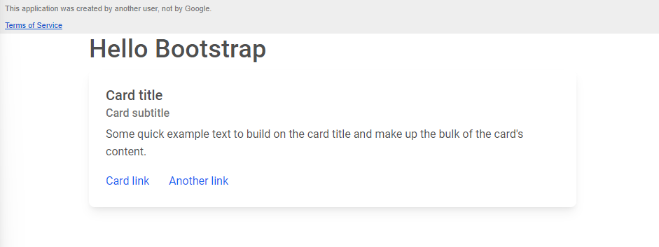
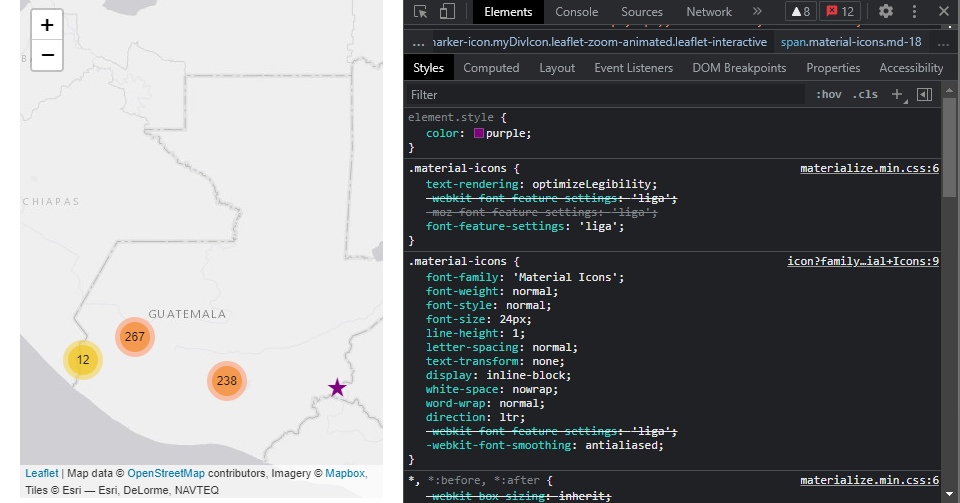

# README

**Description**: A data catalog for Guatemala thematic data. Build as an AppScript front end on the [Data Catalog](https://docs.google.com/spreadsheets/d/1ujgOEwMwjb0kc-JSwA365pPyAf1VY8w4I7K9-Z2OFCU/edit#gid=237000138) Google Sheet using Material Bootstrap for styling. Served through the Guatemala Data Hub Google Site. To include Leaflet for mapping and Ploty-Js for charting.

## Design

- [x] Add base map
- [x] Show current activity location points (use clustering)
- [x] Show heatmap of activity locations as basemap
- [x] Show activity details as popup
- [x] Hover to fill municipality polygon
- [x] Layer control overlay to turn on/off municipalities
- [ ] Add new activity with Material Plus sign; bootstrap multi-page form with 1:M Beneficiaries
- [ ] Double click to add new activity on the map
- [ ] Hide-able filter pane to filter by any attribute column (e.g., Municipality, Activity, IP)
- [ ] Click to select municipality to (zoom, filter or sum activities);
- [x] Toggle Base Map between canvas and satellite
- [x] Zoom to current location (with permission)
- [ ] Quick search overlay for rapid filtering by (Activity Name?)
- [ ] Sidebar [tooltips](https://www.w3schools.com/css/css_tooltip.asp#:~:text=The%20%3Ahover%20selector%20is%20used,with%20class%3D%22tooltip%22%20.)

## Guide

### Resources

* [YouTube - Google Sheet Bootstrap form tutorial](https://www.youtube.com/watch?v=c1AQH4UOmiI)
* [Google AppScript Web Apps guide](https://developers.google.com/apps-script/guides/web)
* [YouTube - Material Bootstrap intro](https://www.youtube.com/watch?v=rQryOSyfXmI&list=PLR1YjA6LL-wAESNVhST5AyaVWehzjASv6&index=9&t=14s)
* [YouTube - Learn Google Spreadsheets - Web Apps Playlists](https://www.youtube.com/c/LearnGoogleSpreadsheets/playlists?view=50&sort=dd&shelf_id=6)
* [Google Query Reference](https://developers.google.com/chart/interactive/docs/querylanguage) & [example](https://stackoverflow.com/questions/51327982/how-to-use-google-sheets-query-or-google-visualization-api-from-apps-script/51328419#51328419)

## How To

### 1. Set up AppScript project

Google AppScript provides a convenient option for creating a front end for a Google Sheet, where the Google sheet serves as the back end. 

1. From the [Data Catalog](https://docs.google.com/spreadsheets/d/1ujgOEwMwjb0kc-JSwA365pPyAf1VY8w4I7K9-Z2OFCU/edit#gid=237000138), open an AppScript project (Extensions > AppScript). 

2. Name the project

3. Create a doGet function. Copy the doGet function below into the Code.gs file after removing all exiting content.

   ```javascript
   function doGet(e) {
     return HtmlService.createHtmlOutputFromFile('index');
   }
   ```

4. Create a new HTML file (click the "+" next to Files and select 'HTML'). Name the file 'index.html'. This must be the same as the string passed to the doGet function, but you may name it however you want.

### 2. Install Bootstrap

We will install bootstrap by linking through a CDN to its stylesheet using the latest verision from getbootstrap.com.

1. For Material Bootstrap, see the [Installation via CDN](https://mdbootstrap.com/docs/standard/getting-started/installation/) instructions and copy the html code to get the latest stylesheet (if you are using regular Bootstrap, instead go to getbootstrap.com):

   ```html
   <!-- Font Awesome -->
       <link
         href="https://cdnjs.cloudflare.com/ajax/libs/font-awesome/5.15.1/css/all.min.css"
         rel="stylesheet"
       />
       <!-- Google Fonts -->
       <link
         href="https://fonts.googleapis.com/css?family=Roboto:300,400,500,700&display=swap"
         rel="stylesheet"
       />
       <!-- MDB -->
       <link
         href="https://cdnjs.cloudflare.com/ajax/libs/mdb-ui-kit/3.10.2/mdb.min.css"
         rel="stylesheet"
       />
       <!-- MDB -->
       <script
         type="text/javascript"
         src="https://cdnjs.cloudflare.com/ajax/libs/mdb-ui-kit/3.10.2/mdb.min.js"
       ></script>
   ```

### 3. Test Deployment

Let's deploy a test version to see if everything is working and allow us to test as we go.

1. In the `<body></body>` of `index.html`, add a container and put some example text in:

   ```html
   <body>
       <div class="container">
           <h1>Hello Bootstrap</h1>
       </div>
   </body>
   ```

2. At the top right of the script project, click **Deploy > Test deployments**.

3. Next to "Select type," click Enable deployment types settings **> Web app**.

4. Under the web app URL, click **Copy**.

5. Paste the URL in your browser and test your web app. You can keep this window open while you build, refresh to see any saved changes to your app.

### 4. Build a Card

The Data Catalog we're building should return a list of cards corresponding to each dataset in our table (one per row). See [USAID's DDL](https://data.usaid.gov/browse) as example.

1. Navigate to [Card component instructions](https://mdbootstrap.com/docs/standard/components/cards/) at mdbootstrap.com. 

2. Scroll down to the example "Titles, text, and links" and select '</> SHOW CODE'. Copy and paste into the container we created in the body tag of index.html. The full body tag should look like this:

   ```html
   <body>
       <div class="container">
   
         <h1>Hello Bootstrap</h1>
   
       
         <div class="card w-100">
           <div class="card-body">
             <h5 class="card-title" id="card-title">Card title</h5>
             <h6 class="card-subtitle mb-2 text-muted">Card subtitle</h6>
             <p class="card-text">Some quick example text to build on the card title and make up the bulk of the card's content.</p>
             <a href="#" class="card-link">Card link</a>
             <a href="#" class="card-link">Another link</a>
           </div>
         </div>
         
       </div>
   </body>
   ```

3. Save changes to index.html and refresh the window where the test deployment is shown. You should now see a header: "Hello Bootstrap" and a card that resembles the example. If anything looks off, check that you have correctly imported from CDN.

​	The page should look like this:



### 5. Create a function to read data from the spreadsheet

We need a function that will return a row from the spreadsheet to populate the card we created. We'll call this function from within index.html to grab the data and then use the data to populate the card for our first dataset.

To fully understand all of the code in this step, you'll need to understand some basics of how AppScript Web Apps and Google Sheets interact. See the primer below.

1. 


### Deploy the app

1. At the top right of the script project, click **Deploy** > **New deployment**.
2. Next to "Select type," click Enable deployment types settings > **Web app**.
3. Enter the information about your web app in the fields under "Deployment configuration."
4. Click **Deploy**.

> **Note:** Web apps deployed in one domain cease to function if their ownership changes to a [shared drive](https://developers.google.com/apps-script/guides/collaborating#collaborating_with_shared_drives) or account in a different domain. This can be corrected by having the new owner or collaborator redeploy the web app in the new domain. Alternatively, if the web app is moved back to its original domain the web app will start functioning again for that domain without redeploying.


Embed in Google Site

1. Open the Sites page where you'd like to add the web app.
2. Select **Insert > Embed URL**.
3. Paste in the web app URL and then click **ADD**.


## App Script Web App Primer

This primer provides some basics on how Apps Script Web Apps and Google Sheets interact in a web app. See Google's developer guide [here](https://developers.google.com/apps-script/guides/web).

### Creating a project

You can create a web app project directly from a spreadsheet (Extensions > Apps Script) or as a standalone in Drive (New > Apps Script). You may need to add Apps Script as an extension first (New > More > Connect more apps). 

The standalone version could be used if you don't need a backend or if you will use multiple Sheets in a single app. Creating directly from a spreadsheet is best if you are not creating a web app (e.g., custom functions or menu items) or only have a single Sheet for a backend. Either way, it doesn't much matter for a web app.

For a web app, you'll want to keep the Code.gs file that the project is initiated with and add at least one `.html` file where you will store your html files. The home page of a web app is by tradition named `index.html`. If you are building a large web app, before you get too far along consider using a [UI framework](#UI-Frameworks) and [modularizing](Modular-CSS-and-JavaScript) your project.

### doGet function

An Apps Script web app requires either a `doGet` or `doPost` function to return an [HTML service](https://developers.google.com/apps-script/guides/html) `HTMLOUtput` object or a [Content service](https://developers.google.com/apps-script/guides/content) `TextOutput` object. The `doGet` or `doPost` function is run when the Sheet loads. Create the `doGet` function in Code.gs (replace the default function):

```javascript
function doGet(e){
    return HtmlService.createHtmlOutputFromFile('index').evaluate();
}
```

The variable `e` can be used for taking parameters from the url and logging purposes but is not required.

### Initial deployment

Once you have the basic project components set up, you can deploy the app so you can test as you go. 

Under Deploy (top right corner), select New Deployment. Click the gear next to "Select type" and choose Web App. Execute as yourself for now (you will likely change this if you plan to distribute the app). Restrict access to only myself (or to Anyone if you need to share the draft with others).

Click the link in the dialog to see the draft web app.

However, note that this deployment will not show any changes to the code you make as you go. To see changes (after initially deploying according to the instructions above), select Deploy > Test deployments. Click the provided link to access the test site, which will reflect any saved changes to your code.

[Manage or redeploy once finished?; What is difference between run as yourself or run as other?]

### Adding permissions

To read and write data from a spreadsheet, you will need to add permissions. You can do this only after you have written code that will attempt to connect to a spreadsheet (e.g., `SpreadsheetApp.openById(id)`). In the code editor with Code.gs open, click Run. This will prompt you to add permissions. Follow the on-screen dialog (yes, you will need to go to Advanced and past the Unsafe warning and Allow).

### Script tags in HTML

You can run JavaScript directly within your HTML using this syntax: <? ?>. 

For example, you could pass a header as a variable in this way:

```html
<body>
    <? var title = "Hello Bootstrap"; ?>
    <h1>
        <?= title; ?>
    </h1>
</body>
```

In this example, you start by declaring a variable `title` and assigning its value as `"Hello Bootstrap"`. In the H1 tag you then simply return (print) the variable. The `=` sign indicates that the contents of the variable should be returned (printed). If you left out the `=`, the code would run but nothing would print to the screen in this H1 tag.

### Passing variables on load

You can pass data to your HTML on load of the Sheet using the doGet function. 

First, you need to store the HTML Service template as a variable so that you can assign additional variables to it before evaluating it, like so (in Code.gs):

```javascript
function doGet(e){
    var tmp = HtmlService.createTemplateFromFile("index");
    tmp.title = "Hello Bootstrap";
    return tmp.evaluate();
}
```

In your HTML, you no longer need to define the variable `title`, you simply access `title` when needed (in index.html):

```html
<body>
    <h1>
        <?= title; ?>
    </h1>
</body>
```

### Reading data from spreadsheet on load

You can use this same pattern to read data from the Sheet and pass it to the template. Let's extend this example to read in data from a sheet: 'data' and return the first column as a list.

In Code.gs we read the data from the spreadsheet, assign it to a variable, and assign the variable to the template:

```javascript
var id = ''

function doGet(e){
    var ss = SpreadsheetApp.openById(id);
    var ws = ss.getSheetByName('data');
    var list = ws.getDataRange().getValues();
    var tmp = HtmlService.createTemplateFromFile("index");
    
    tmp.title = "Hello Bootstrap";
    tmp.list = list.map(function(r){ return r[0]; });
    return tmp.evaluate();
}
```

Note that for this example we need to flatten the initial list (an array of arrays) to a one-dimensional array using the map function. Depending on your application, you may be fine with the array of arrays.

In index.html we iterate through the list using a for loop and print each list item in an unordered list:

```html
<body>
    <h1>
        <?= title; ?>
    </h1>
    <ul>
        <? for(var i=0; i<list.length; i++){ ?>
        
        <li><?= list[i]; ?></li>

		<? } ?>
    </ul>
</body>
```

Importantly, note that this pattern requires you to refresh the page to access any new data in the spreadsheet.

### Passing HTML

You can pass directly HTML by using <?! = myHTMLvar?> which will pass the HTML string and return it without "escaping" it. If you exclude the exclamation point, the string will be returned exactly as written, html tags and all. This is because without the exclamation mark the browser escapes the HTML, making it not HTML anymore, just plain text. This is especially important if your user is providing input that is then passed to the script. If you do not escape the user input, you are allowing your user to run any HTML code they want on your server. Bad idea. However, you can pass unescaped HTML after you have escaped any user input.

Instead of passing the list as an array and then handle the rendering in the HTML, it might be cleaner to convert the data directly to HTML and passing that to the template.

In Code.gs use the map function to wrap the data in html tags and then join to collapse from an array to a string. Note you must use the `createTemplateFromFile` method to access these variables:

```javascript
function doGet(e){
    var ss = SpreadsheetApp.openById(id);
    var ws = ss.getSheetByName('data');
    var list = ws.getDataRange().getValues();
    var htmlListArray = list.map(function(r){ return '<li>' + r[0] + '</li>'; }).join('');
    var tmp = HtmlService.createTemplateFromFile("index");
    
    tmp.title = "Hello Bootstrap";
    tmp.list = htmlListArray;
    return tmp.evaluate();
}
```

in index.html, return the unescaped HTML:

```html
<body>
    <h1>
        <?= title; ?>
    </h1>
    <ul>
        <?!= list ?>
    </ul>
</body>
```

### Logging

For testing, you can write to the [log](https://developers.google.com/apps-script/guides/logging) using the syntax `console.log()`. For example, to log the `htmlListArray` we created above:

```javascript
function doGet(e){
    var ss = SpreadsheetApp.openById(id);
    var ws = ss.getSheetByName('data');
    var list = ws.getDataRegion(ws).getValues();
    var htmlListArray = list.map(function(r){ return '<li>' r[0] + '</li>'; }).join('');
    console.log(htmlListArray);
	//
}
```

For server-side logs, on the left sidebar of the App Script editor, open Executions and then expand the call to the doGet function (should be first in the list, hover over the entry and click the down arrow to the right).

For app-side logs, hit F12, select the Console, show the left sidebar, and select messages. Logs will be printed under 'user messages'.

### Event Listeners

Event listeners allow us to execute JavaScript based on user input. For example, we might want to add a button that allows the user to write some data to the spreadsheet.

First, create a button on the page in index.html:

```html
<body>
    <h1>
        <?= title; ?>
    </h1>
    <ul>
        <?!= list ?>
    </ul>
    
    <button id = 'run'>
        Run
    </button>
</body>
```

Next, add the required JavaScript in a script tag index.html (located within the body tag below the button):

```html
<script>
	document.getElementById('run').addEventListenter('click', logData);
    function logData(){
        google.script.run.userClicked();
    }
</script>
```

We added an Event Listener to the button listening for the click event. Once the button is clicked, the logData function is run. The logData function will "call back" to the Code.gs file and run the UserClicked function in Code.gs, which could be:

 ```javascript
 function userClicked(){
     console.log("Someone Clicked the Button");
 }
 ```

This will simply write to the log every time the button is clicked. 

Often, all Event Listeners are included in a general Event Listener called `DOMContentLoaded` which listens for the page to load. This would look like this (in a script tag in index.html):

```javascript
<script>
document.AddEventListener('DOMContentLoaded', function(){
    document.getElementById("run").addEventListener("click", logData)
    ///
})
///
</script>
```

> All of the code in index.html is visible to the world. You don't want to include anything sensitive in your html file. Instead, you should use the pattern above where we "call back" to the server-side code using `google.script.run` and run the function stored there. This does slow load times because the code has to round-trip to a server but is safer when interacting with your underlying spreadsheet.

### Getting user input

Let's set up a field where we can accept user input. 

In index.html:

```html
<body>
    <h1>
        <?= title; ?>
    </h1>
    <ul>
        <?!= list ?>
    </ul>
    <label>Add item:</label><input type='text' id='newItem'>
    <button id = 'run'>
        Run
    </button>

    <script>
      function logData(){
        var input = document.getElementById('newItem').value;
        google.script.run.userClicked(input);
        alert(input);
        document.getElementById('newItem').value = '';  // clear contents
      }

      document.getElementById('run').addEventListener("click", logData)

    </script>
</body>
```

In Code.gs:

```javascript
function userClicked(input){
    console.log(input + " is the Input");
} 
```

The above will simply log the input to the Execution Log (note this was not working at the time of writing).

### Writing to a spreadsheet

Now we can write this to the spreadsheet instead of simply logging the event in Code.gs:

```javascript
function userClicked(input){
    var ss = SpreadsheetApp.getSheetById(id);  // id is defined globally
    var ws = ss.getSheetByName('data');
    var rowContents = [input];  // rowContents should be 1d array
    
    ws.appendRow(rowContents);
}
```

Note that this user-provided input will not show up in the unordered list on the web app, although it will be included in the Sheet as a new entry. This is because the `doGet` function only runs on load. You can refresh the page to see the newly added list item.

To add that item to the list, you would need to use JavaScript to interact with the DOM. We would update `logData` like so (if you had more than one unordered list, you would need to assign the list an id and use the `getElementById` method instead):

```javascript
function logData(){
    var input = document.getElementById('newItem').value;
    google.script.run.userClicked(input);
    document.getElementById('newItem').value = '';  // clear contents
    
    var node = document.createElement('li');
    node.appendChild(document.createTextNode(input));
    document.querySelector('ul').appendChild(node)
}
```

### Interacting with a spreadsheet

We've seen how to read data from a spreadsheet on load and how to write to a spreadsheet using user input. What about interacting with a spreadsheet in other ways?

Let's imagine we want to take some user input, find the value associated with the input in the Sheet, and then return the value in the column one over.

First, we need to update our project's HTML to include a field for input and for output. Let's add a dropdown to restrict input and add an output field. Use the <select> tag and pass a list of <option> tags to initialize the dropdown, provide `id="selection"`. Use the <input> tag to create the output field and provide `id="output"`. 

In Code.gs:

```javascript
function getData(input){
    var ss = SpreadsheetApp.openById(id);  // id is defined globally
    var ws = ss.getSheetByName('data');
    var data = ws.getDataRange().getValues();
    
    var keys = data.map(function(r){return r[0]; });
    var values = data.map(function(r){return r[1]; });
    
    var position = keys.indexOf(input);
    
    if(position > -1){  // indexOf method returns -1 if not found
        return values[position];
    } else {
        'Unavailable'
    }    
}
```

Previously, we would have called this function within a function in index.html, like this:

```javascript
// this code will not work
function getLookup(){
	var userSelection = document.getElementById("selection");
    google.script.run.getData(input);
}
```

However, as you can see this doesn't give us the opportunity to do anything with the data that we return. You can't simply assign the output of the `getData` function to a variable like you might otherwise. Instead, you can use the `withSuccessHandler` method to pass the returned value from `getData` to another function.

Let's start by writing the function that will do what we want to do with our result from `getData` in index.html:

```javascript
function updateOutputField(lookupVal){
    document.getElementById("output").value = lookupVal;
}
```

Next let's extend the `getLookup` with the success handler:

```javascript
function getLookup(){
	var userSelection = document.getElementById("selection");
    google.script.run.withSuccessHandler(updateOutputField).getData(userSelection);
} 
```

To recap, you need three functions (and likely an event handler) to get data from a spreadsheet and then do something with it:

1. The app-side function that takes user input after the user completes an action (`getLookup`)
2. The server-side function that processes the input and returns something from the spreadsheet (`getData`)
3. The app-side function that is called upon success of the server-side function and passes the data back into the DOM (`updateOutputField`)

Often, you'll see the third function provided as input directly to the `withSuccessHandler` method. That would look like this:

```javascript
function getLookup(){
	var userSelection = document.getElementById("selection");
    google.script.run.withSuccessHandler(function updateOutputField(lookupVal){
    	document.getElementById("output").value = lookupVal;
}).getData(userSelection);
} 
```

This looks quite confusing, but hopefully now you can see how this function would work.

### Methods for Reading Data

The `getRange` function is the go-to utility for getting data from a spreadsheet. You can pass simply a row and column to get a 1-d array or you can pass optional parameters for number of row and number of columns. Use `getLastRow()` to identify the number of rows if unknown.

```javascript
function getData(){
    var ss = SpreadsheetApp.openById(id);  // id is defined globally
  	var ws = ss.getSheetByName('data');
    var data = ws.getRange(1, 1, ws.getLastRow(), 2).getValues();
    
    for (var row in data) {
        for (var col in data[row]) {
          Logger.log(data[row][col]);
        }
  	}
}
```

Alternatively, you can use `getDataRange` to grab the entire contents of a sheet.

```javascript
function getData(){
    var ss = SpreadsheetApp.openById(id);  // id is defined globally
    var ws = ss.getSheetByName('data');
    var data = ws.getDataRange().getValues();
}
```

Finally, you can use "A1" notation instead of numbers of rows and columns if that is more convenient

```javascript
function getData(){
	///
    var data = ws.getRange("A1:C").getValues();
}
```

Note that this will not detect the last row, but rather give you all data to the bottom of the spreadsheet.

You can combine non-consecutive ranges with `getRangeList`

```javascript
function getData(){
	///
    var data = ws.getRangeList(["A1:C", "E1:F").getValues();
}
```

Use `shift` method to pop the header row from an array. This will both save the first row to its own array and delete it from the data.

```javascript
function getData(){
    var data = ws.getDataRange().getValues();
    var headers = data.shift()
}
```

#### IMPORTANT

> You're client-side code will succeed but [mysteriously fail](https://stackoverflow.com/questions/56895811/google-script-run-executes-but-it-returns-null-while-code-gs-function-does-hav) on the app side if you try to pass [restricted data types](https://developers.google.com/apps-script/guides/html/reference/run) including datetime objects in your array!

### Use of Objects

Objects in JavaScript are good data structures for storing multiple values as opposed to a simple array. The object is constructed with `object = { }` notation. You can add key, value pairs to the object with notation `object[key] = value`. 

Here's an example of the use of an object to store responses to a form and then print them to the console:

```javascript
var formResponses = {}

formResponses['firstName'] = 'John';
formResponses['lastName'] = 'Smith';

console.log(formResponses.firstName, formResponses.lasName)

//"John"
//"Smith"
```

You can even assign functions to objects using the same notation.

Note that they syntax `formResponses['firstName']` is equivalent to the syntax `formResponses.firstName`.

### Form Validation

 HTML5 provides easy validation for forms to indicate to users when a field must be completed, simply add `validate` to the form field. 

```html
<input id="fname" type="text" required>
```

However, this will not prevent the user from submitting incomplete data, it will only show the empty fields in red. To validate before entry, you need to adjust the JavaScript that runs the submit action.

```javascript
function submitForm(){
    // create object to track fields and failure messages
    var toValidate = {
        fname: "First Name is Required",
        lname: "Last Name is Required"
    };
    
    // loop through fields and validate
    var idKeys = Object.keys(toValidate);
    var allValid = true;    
    idKeys.forEach(function(elID){
        var isValid = checkIfValid(elID, toValidate[elID]);
        if(!isValid){
            allValid = false;
        }
    });
    
    // submitForm if all valid
    if(allValid){
        addRecord();
    }
}

function checkIfValid(formField, message){
    var isValid = document.getElementById(formField).checkValidity();
    if(!isValid){
        alert(message);  // use a UI Framework for better messages (e.g. toast)
        return False
    } else {
        return True;
    } // END IF
}

function addRecord(){
    var formResponses = {}
    formResponses.firstName = document.getElementById("fname").value;
    ///
}
```

You can add additional validation logic besides just whether it has content or not using `required pattern` and a regex expression. This will work well for email addresses, zip codes, phone numbers, and other data that have a standardized format. 

```html
<input id="fname" type="text" required required pattern="^/d{5}$">
```

Any additional validation would need to be done using JavaScript or on the server side.

> **Server-side validation**
>
> You must also prevent users from providing malicious inputs that will run on your server. This is called server-side validation.

### Parameters from url

You can pass parameters into the app through the url provided. Add parameters at the end of the url after a `?` character where the parameters are specified as `?param=input` and multiple parameters are joined by the`&` character. For example you could have `?fname=mark&lname=smith`. 

These parameters can be accessed using the `parameter` or `parameters` method on the `e` object passed to  `doGet` function:

```javascript
function doGet(e){
    console.log(e.parameter)
    var fname = e.parameters.fname
    var lname = e.parameters.lname
}
```

You can utilize this in your app by using links. Use `ScriptApp.getService().getUrl();` to get the base url and then add parameters:

```javascript
<a href= "<?= ScriptApp.getService().getUrl(); ?>?fname=Mark&lname=Smith">
```


### Modular CSS and JavaScript

For more complex projects, you might want to pull your CSS and/or JavaScript into separate files. Apps Script only allows you two file types: `.gs` and `.html`, so you need a workaround.

Create a new file called `js.html` and `css.html` in your project.

Copy anything within <style></style> to `css.html` and anything within <script></script> to `js.html`. These must still be within the <style> and <script> tags, respectively.

In Code.gs, you need to write a function that will pass the CSS and JavaScript as well as edit the doGet function.

```javascript
function doGet(e){
    return HtmlService.CreateTemplateFromFile("index").evaluate();  // create template not output
}

function include(filename){
    return HtmlService.createHtmlOutputFromFile(filename).getContent();
}
```

In your index.html, add the following to the <head> tag and bottom of the <body> tag.

```html
<head>
    <base target="_top">
    <?!= include("css.html"); ?>
</head>

<body>
    // rest of code here
    
    <?!= include("js.html"); ?>
</body>
```

Importantly, the `doGet` function must create a Template from File rather than Output from File otherwise the <? ?> will be rendered as plain text (note the `evaluate` method must be called as well).

### Modular HTML templates

You may also want to modularize your html templates if you're creating  a multi-page app or a series of tabs, for example. A project structure might look like this:

```
*
|--Code.gs
|--index.html
|--about.html
|--css.html
|--js.html
|--functions.gs
|--utils.gs
```

In Code.gs, your doGet could be:

```javascript
function doGet(e){
    loadForm()
}

function loadForm(){
    
}
```

To navigate through a multi-page app, see [multi-page app](#multi-page-app).

### Multi-page app

Create Route object to store pages and the functions that load them

Update the doGet function to log all possible routes, then check if they exist and fire the function that loads the page. Routes will be provided as [parameters in the url](#parameters-from-url). 

```javascript
var Route = {}
Route.path = function(route, callback){
    Route[route] = callback
}

function doGet(e){
    Route.path("form", loadForm);
    Route.path("about", loadAbout);
    
    if(Route[e.parameters.v]){
        return Route[e.parameters.v]();
    } else {
        render("index");
    }
}

function render(file, kwArgs){
	var tmp = HtmlService.createTemplateFromFile(file);
    if(kwArgs){
        var keys = Object.keys(kwArgs);
        keys.forEach(function(key){
           tmp[key] = kwArgs[key]; 
        });
    } // END IF
}

function loadForm(){
    var ss = SpreadsheetApp.openById(id);
    var ws = ss.getSheetByName('data');
    var list = ws.getDataRegion(ws).getValues();
    var htmlListArray = list.map(function(r){ return '<li>' r[0] + '</li>'; }).join('');
    return render("form", {list: htmlListArray});  // format {param1: ..., param2: ...}
}

function loadAbout(){
    //
    return render("about")
}
```

### UI Frameworks

You can use a UI framework to improve the user interface very quickly. Common UI frameworks are:

* [Bootstrap](getbootstrap.com)
* [Material Bootstrap](https://mdbootstrap.com/docs/standard/getting-started/installation/)
* [Materialize](https://materializecss.com/getting-started.html)

Load these from CDN by copying the relevant CSS link from the "getting started" page and pasting it the <head> tag of your index.html file and copying the relevant script link above any other JavaScript at the bottom of the <body> tag. (It's best practice to import JavaScript files at the end of the body to reduce page load time). Alternatively, there may be code for a full DOM from which you can start your project. You may also need a meta tag and link to fonts or icons, read the docs for whichever framework you choose.

The common workflow for using these frameworks is to navigate to the type of element you need, copying the code, and pasting it into your project before customizing it for your use case. If you need additional information, you can use the Inspector (F12) to see how they implemented their examples on the page.

These frameworks often rely on a grid system and set of pre-defined classes that you should familiarize yourself with.

Before selecting a framework, review the available components to make sure it has what you need and look at the styling of those elements to make sure you like how it looks.

> **Autocomplete**
>
> Check out the Materialize [autocomplete](https://materializecss.com/autocomplete.html) function as an affordance for easier search/select of options. You pass the list of options to the `data` property as an object with optional icon strings. You'll need to load those options on page load. See [this tutorial](https://www.youtube.com/watch?v=GhAmyLukD6o) for a walkthrough.

### Tables

Tables can look intimidating but can be handled fairly easily with a combination of javascript and html. You'll want to use a UI Framework or else it will also require quite a bit of CSS.

First, simply initialize an empty table where you want it in your html (here we'll initialize with hard coded headers but you could extend this to read headers from the data source):

```html
<body>
    <table>
        <thead>
            <tr>
                <th>First Name</th>
                <th>Last Name</th>
            </tr>
        </thead>
        
        <tbody id='myTable'>

        </tbody>
    </table>
</body>
```

To get the data from a spreadsheet, rather than using the hard-coded data variable `data`, we need to add to our Code.gs:

```javascript
function getTableData(){
    var ss ; //
    var ws ; //
    var data ; // ignore first row if using hard coded headers
    
    return data;
}
```

Finally, write JavaScript (in a <script> tag) to load the table with data once loaded:

```javascript
document.addEventListener("DOMContentLoaded", function(){
    google.script.run.withSuccessHandler(populateTable).getTableData();
});

function populateTable(dataArray){
    var tbody = document.getElementById("table-body");
    
    dataArray.forEach(function(r){
        var row = document.createElement("tr");
        var col = document.createElement("td");
        r.forEach(function(cell){
            col.textContent = cell;
        	row.appendChild(col);
        })
        tbody.appendChild(row);
    })); 
}
```

In this code, we use an Event Listener to know when the empty table is loaded in the DOM, then run the `getTableData` function we wrote to grab the data and use the `withSuccessHandler` to pass that data to the function `populateTable`. 

In `populateTable`, we have an outer loop that iterates through every row and an inner loop that iterates through every column (or cell in the row). The inner loop sets the text content of the <td> element to the value in each column then appends as a child element to the row. The outer loop is looping through each row, and once constructed by the inner loop, appends the entire row to the table body.

### Deploying as an IFrame

App Script web apps can be very easily integrated into another website through an IFrame. 

```html
<iframe src="<myappurl>" frameborder="0" width="100%" height="500px"></iframe>
```

However, you must first evaluate the HTML with additional method `.setXFrameOptinosMode` when rendering the HTML in your app:

```javascript
function render(){
    tmp = HtmlService.createTempalteFromFile("index");
    tmp.evaluate().setXFrameOptionsMode(HtmlService.XFrameOtpionsMode.ALLOWALL);
}
```

If you have a multi-page app, you must also change the `target` property in the <base> tag of the <head> tag for all HTML pages to `"_self"`.

```html
<head>
    <base target = "_self"
</head>
```

### Deploying to Google Site

A great option for deploying an App Script web app is to embed it into a Google Site. You can embed into a Google Site by selecting the "< > Embed"  element and providing the deployed web app url.

### Safety & accessibility reminders

Do not put code in your html files that should not be visible to the public

### Best Practices

Use Closing comments to indicate what each closing tag is doing,

```html
</div> <--! CLOSE CONTAINER -->
```

### Limitiations

#### Secrets

It is EXTREMELY difficult to hide API keys in Apps Script projects at this time. This limits your ability to use libraries like Esri Leaflet.

#### Concurrency

If you will have even two concurrent users, you must account for the possibility that they are both interacting with the spreadsheet at the same time. The best way to handle this is to use the Lock method to prevent concurrent edits.

See [this Medium article](https://medium.com/google-developer-experts/tips-on-building-a-reliable-secure-scalable-architecture-using-google-apps-script-615afd4d4066) for more issues with scalability.

### Rapid Testing

You can rapidly test new features by using [codepen.io](codepen.io) to display very basic apps. Use this to test the html features of your app. It won't work for accessing Google Workspace products however.

## Leaflet

 [Quick Start](https://leafletjs.com/SlavaUkraini/examples/quick-start/) 

[Alternative quick start](https://joshuafrazier.info/leaflet-basics/)

[Mapster Mapping in LeafletJS YT Playlist](https://www.youtube.com/playlist?list=PLm76kc4VPkn27kRYq-58COO5r5bQdrKyy)

### Import via CDN

Follow the [Quick Start](https://leafletjs.com/SlavaUkraini/examples/quick-start/) guide to add Leaflet's CSS and JavaScript to your project and include a div with a map element.

### Base map options

See [here](https://leaflet-extras.github.io/leaflet-providers/preview/) for a comprehensive list of different base maps. Esri's Light Grey base map is a good, free option:

```javascript
L.tileLayer('https://server.arcgisonline.com/ArcGIS/rest/services/Canvas/World_Light_Gray_Base/MapServer/tile/{z}/{y}/{x}', {
	attribution: 'Tiles &copy; Esri &mdash; Esri, DeLorme, NAVTEQ',
	maxZoom: 16
}).addTo(map);
```

Note that all ESRI basemaps use the Web Mercator Auxiliary Sphere ([docs](https://doc.arcgis.com/en/data-appliance/6.4/reference/common-attributes.htm)) which is EPSG 3857. This is also the default Leaflet CRS, however differs from the USAID Data Standards (EPSG 4326).

### Add points from Sheet

The basic method for adding a marker is:

```javascript
var marker = L.marker([51.5, -0.09]).addTo(map);
```

To add multiple markers, we'll need to loop over pairs of coordinates read in from the Sheet. 

#### Read in data from sheet

To read in from the Sheet, create a function in Code.gs. This will also remove any blank or #N/A entries.

```javascript
function getCoords(){
  var ss = SpreadsheetApp.openById(ss_id);
  var ws = ss.getSheetByName('data');
  var coords = ws.getRange(2, 9, ws.getLastRow()-1, 2).getValues();

  // remove blank and N/A coordinates 
  for(let i=0; i<coords[0].length; i++) {
    if(coords.every(col => col[i] =='' || col[i] == "#N/A")) {
      for(const col of coords) col.splice(i, 1);
      i--;
    }
  }
  Logger.log(coords);

  return coords

}
```

#### Call function when DOM loads

This code should be within <script> tags. Note that this uses the [Marker Cluster](#marker-cluster) plugin.

```javascript
document.addEventListener('DOMContentLoaded', function(){
    updateMap();
})

function mapActivityLocations(coords){
    console.log(coords)
    var markers = L.markerClusterGroup();
    for (var i in coords) {
        markers.addLayer(L.marker(coords[i], {icon: starIcon}))
    }
    map.addLayer(markers);
}

function updateMap(){
    google.script.run.withSuccessHandler(mapActivityLocations).getCoords();
}
```

### Custom Icons

If you are using MaterialCSS, or at least have imported Google Icon Fonts, you can use these icons in place of the standard set. See [here](https://fonts.google.com/icons) for a list of available icons. (If you are not using Apps Script, you can also download images (png, svg, etc.) and pass the relative filepath to the html property.) 

```javascript
const starIcon = L.divIcon({
  html: '<span class="material-icons md-18">star_rate</span>',
  iconSize: [18,18],  // specify size in class above
  iconAnchor: [9,9],  // from top left corner
  popupAnchor: [0, -18], // from icon anchor, up is negative
  className: 'myDivIcon'
});

L.marker([15.3237537, -91.47], {
    icon: starIcon
  }).addTo(map);
```

Why this works: The html property of the divIcon class is passed the html of the star_rate icon in Google's icon set of the size 18 pixels (24, 36, and 48 are also options, see [here](https://developers.google.com/fonts/docs/material_icons#sizing)). We can then specify the size as 18x18 pixels to the `iconSize` property. The `iconAnchor` property tells Leaflet what point on the icon to keep in place when zooming. In this case, we want the vertical and horizontal center to stay in the same place. If using the default place marker, you would want the vertical bottom and horizontal center to stay put. Specifying the className helps Leaflet with styling the div, possibly by avoiding conflicts with MaterialCSS. You then pass the created  Div Icon to the marker class and add it to the map. 

### Marker Cluster

[Marker Cluster](https://github.com/Leaflet/Leaflet.markercluster) is a popular plugin for Leaflet. To use it in your project, you cannot download via CDN (as of this writing) due to a [MIME type error](https://stackoverflow.com/questions/59457683/leaflet-markercluster-plugin-not-loading). Instead, copy/paste the contents of the necessary files in the `dist` folder to `.html` files in your project and then use the custom `include` function to load the stylesheets and scripts:

- `MarkerCluster.css`
- `MarkerCluster.Default.css` (not needed if you use your own `iconCreateFunction` instead of the default one)
- `leaflet.markercluster.js` (or `leaflet.markercluster-src.js` for the non-minified version)

To call marker cluster

```javascript
var coords = [
  [15.3237537, -91.47],
  [14.9360448, -91.4593998],
  [14.86711, -91.5394938],
  [14.8570618, -91.5952753],
  [14.98567046, -91.77016372],
  [14.87463, -91.46126],
  [14.858316, -91.541867],
  [14.70184485, -91.86272871],
  [14.8873224, -91.4573365],
  [14.85756891, -91.48541847],
  [14.85481128, -91.52204135],
  [14.85481128, -91.52204135],
  [14.870957, -91.62808]
]

var markers = L.markerClusterGroup();

coords.forEach(function(coord){
    markers.addLayer(L.marker(coord))
})

map.addLayer(markers);
```

### Popups

Popups in Leaflet can be a bit unpredictable in terms of styling if using the multiple different methods available to create them, try to stick with one. 

```javascript
///
var markers = L.markerClusterGroup();

coords.forEach(function(coord){
    html = ''
    markers.addLayer(L.marker(coord))
    .bindpopup(html)
})
```


### Heatmap

Leaflet.heat


### GeoJSON

Leaflet provides [multiple methods](https://leafletjs.com/SlavaUkraini/reference.html#geojson) for styling and filtering GeoJSON objects. Because a single GeoJSON object can contain multiple geometry types, you need to select the right method for the type of geometry you want to style. For example, the style function in the example below will only apply to point features.

```javascript
L.geoJSON(data, {
    style: function (feature) {
        return {color: feature.properties.color};
    }
}).bindPopup(function (layer) {
    return layer.feature.properties.description;
}).addTo(map);
```

See the documentation for more information.

##### Loading GeoJSON

There are a few options for loading GeoJSON  data. Before loading, make sure the GeoJSON is in the right CRS and has no other issues, such as swapped lat/lon (there is a lack of standardization in GeoJSON). See the GeoJSON utilities below.

###### Import from Drive App

I don't recommend this option since Drive App is a little slow to find and load the contents of a file, but there might be a better way to identify a file stored in Drive:

```javascript
function getMunis() {
  var fileName = "municipalities.geojson";
  var files = DriveApp.getFilesByName(fileName);
  if (files.hasNext()) {
    var file = files.next();
    var content = file.getBlob().getDataAsString();
    var json = JSON.parse(content);
    return json;
  }
}
```

###### Load from web service

You can load the data from a hosted platform. My go-to would be gitub (make sure you get the raw content). Use a javascript fetch call.

```javascript
var myGeoJson = false;
fetch('<url>', {
    method: 'GET'
})
.then(response => respons.json())
.then(json => {
    console.log(json)
    var geojson = L/geoJSON(json, {
        style: function(feature) {
            return {
                fillOpacity:0
            };
        }
    }).addTo(map);
    //
    map.fitBounds(geojson.getBounds());
})
.catch(error => console.log(error.message));
```

###### Store as file in project

Maybe the fastest way to load a small GeoJSON dataset is to simply store it in the project as it's own file. Use this in your Code.gs:

```javascript
function getMunis() {
	var jsonString = HtmlService.createHtmlOutputFromFile("my-json.html").getContent();
	var jsonObject = JSON.parse(jsonString);
    return jsonObject
```

##### GeoJSON utilities

- GeoJSON.io (create GeoJSON from scratch)
- rewind-GeoJSON (at mapster: to correct for right-hand rule)
- mapshaper (convert filetypes, simplify)
  - Always snap vertices on import! Otherwise simplifying will result in slivers
  - Use the Douglas-Peucker algorithm (this matches the `geopandas.series.simplify` ([link](https://geopandas.org/en/stable/docs/reference/api/geopandas.GeoSeries.simplify.html)) method)

- GeoJSONlint (for debugging geojson files)

Some applications were built by coders not geographers, so lat/lon can be switched. Always check this. Leaflet requires [lat, lon].

Right-hand rule: 

### Layer Control

The Layer Control is very simple to set up. See the [documentation](https://leafletjs.com/SlavaUkraini/reference.html#control-layers) and [example](https://leafletjs.com/SlavaUkraini/examples/layers-control/) for guidance. To default a layer to off, do not add it to the map (don't call `.addTo(map)` method) instead just pass it to the Layer Control.

### Feature Group

Feature groups are helpful for collecting different objects into a single layer group. You can use Feature Groups for legend control, binding popups and tooltips, and setting event listeners.

```javascript
a = L.marker(...)
b = L.marker(...)
c = L.marker(...)
var myFeatureGroup = L.featureGroup([a, b, c])
```

You can iterate through the layers in a feature group with `eachLayer` method

```javascript
myFeatureGroup.eachLayer(function(layer){
    console.log(layer)
})
```

```javascript
```


### Bounds

Use bounds to auto calculate zoom and extent based on data on the map. It's best to use a Feature Group to simplify calculation of the bounds.

```javascript
map.fitbounds(layer.getBounds())
```

### Events

Leaflet has special methods to handle events on the map. See the documentation for the type of Leaflet object you want to bind an event to, there you will find the specific instructions for that event.

In this example, we'll highlight the marker where the user is hovering by swapping its icon from a black icon to a red icon.

```javascript
redIcon = L.icon(...)
blackIcon = L.icon(...)
var markers = []
var coordinates = [[...]]
coordinates.forEach(function(coords){
    var maker = L.marker(coords, {
        icon: blackIcon;
    }).on('mousemove', function(e) {
          e.target.setIcon(redIcon);
    }).on('mouseout', function(e) {
        e.target.setIcon(blackIcon);
    })
})
```

Use console.log to understand what you are getting back from an event.

```javascript
map.on('mousemove', function(e) {
    console.log(e)
})
```

### Layer Drawing Order

The drawing order of layers may not be the same as the order in your scripts if you are fetching data from services. You can set the z-order of layers to manage drawing order, but if you have many layers it might be hard to keep track of the z values you've already used. Instead, you can use `layer.bringToFront()`. 

### Interactions


#### Filter

##### Typeahead

This will filter based on whether a feature contains the text input provided by a user.

```javascript
document.addEventHandler('keyup', '#search', function(e) {
    var userInput = e.target.value;
    myGeoJSON.eachLayer(function(layer) {
        if(layer.feature.properties.title.toLowerCase().indexOf(userInput.toLowerCase())>-1) {
            layer.addTo(map);
        } else {
            map.removeLayer(layer);
        }
        console.log(layer);
    })
})
```

##### Range Slider


##### Dropdown

* Use <select> element, with initialization as blank (no option selected)
* Pass from filter to map
* Pass from map to filter

```html
<body>
    <select>
        <option "">(No Option Selected)</option>
    </select>
</body>
```

```javascript
///loop through options and add as html elements

///create event handler

///filter

/// set up mouseover event handler
```


##### Multiple filters

```javascript
var filters = {
	text: '',
	range: []	
};

var min = 0;
var max = 0;
filters.range = [min, max]
.on('slide', function(e) {
    filters.text = e.target.value;
})

/// union filters, for exclusive search all must be true
function filterGeoJSON(layer) {
    var isItFound = false;
    if(layer.feature.properties.title.toLowerCase().indexOf(filters.text.toLowerCase()){
       isItFound = true;
       })
    if /// second condition
    if (isItFound) {
        layer.addTo(map);
    } else {
        map.removeLayer(layer);
    }
        
}
```


#### User Inputs

* Leaflet.draw is recommended, but many libraries are available (leafletpm is one to watch)
* simple user inputs can be handled by map events

```javascript
map.on('dblclick', function(e) {
    var newMarker = L.marker(e.latlng).addTo(map);
    /// other stuff
})
```


### Mouseover Calculations

* Use turf.js to get points within a polygon, need array of points and array representing bounds of the polygon

### Geolocation

#### Locate User

* developer.mozilla.org: geolocation
* Add a custom icon (crosshairs) and attempt to access the users geolocation. That will probably prompt a popup. If allowed, zoom to the users location.

#### Search bar

To create a search bar for users to find locations by search, the [Leaflet Control Geocoder](https://www.liedman.net/leaflet-control-geocoder/) is a great free option that uses the open source Nominatim project but it lacks the auto-complete features and is less robust than the [Esri Leaflet geocoder](https://esri.github.io/esri-leaflet/examples/geocoding-control.html).

To use the Esri Leaflet geocoder, you will need an API key and [store it securely](#hide-api-key) in your client-side code. You can set up a free Developer account to get access to the free tier, which should be sufficient for most small applications. You don't need a credit card for this account, so at worst they will turn off your app once it hits quotas.

```javascript
// create search control
const searchControl = L.esri.Geocoding.geosearch({
    position: "topright",
    placeholder: "",
    useMapBounds: true,
    providers: [
        L.esri.Geocoding.arcgisOnlineProvider({
            apikey: apiKey,
            nearby: {
                lat: 14.683945,
                lng: -90.542282
            }
        })
    ]
}).addTo(map);

var results = L.layerGroup().addTo(map);

searchControl.on('results', function (data) {
    results.clearLayers();
    for (var i = data.results.length - 1; i >= 0; i--) {
        results.addLayer(L.marker(data.results[i].latlng)
        .bindPopup(data.results[i].properties.LongLabel)); // Add popup with results detail
        console.log(data)
    }
});
```

This is very similar to the quickstart guide code, however note that I logged the data object returned by the search to find a property that I can bind to a popup so that the point has additional information for the user. I've also customized the icon used.

### Hide API key

This has not been tested, but is based on some suggestions online (search "how to hide API key in google apps script). This hard codes the key into the server-side code, which shouldn't be available to the end user. One extra step is to use a hidden method (trailing underscore) to further restrict access to the function contents on the client side. 

In Code.gs:

```javascript
function getSecret_() {
    return "API-KEY"
}

function getAPIKey() {
    return getSecret_()
}
```

### Routing

* Use plugin Routing Machine for routing
* You can calculate driving distances between different points as a better proxy for distance than direct lines

### Big Data

Loading anything larger than 1MB can slow browsers, and anything larger than 10MB is probably prohibitive for most users.

* Encoding polygons (mapbox/polyline): converts individual polygons to ASCII that can be decoded by the browser but is significantly smaller in loading.
* Mapshaper: you can simplify polygons (delete vertices) to reduce the size of the file
* Mapbox: you can serve as a tiled baselayer

### Converting and Projecting

* See Mapshaper's wiki to check out their command line tools
* Use Geopandas

### Other Plugins

https://leafletjs.com/SlavaUkraini/plugins.html

Heatmap

leaflet-choropleth

FeatureGroup.SubGroup

Markercluster

HTMLLegend

Proj4Leaflet

Leaflet Vector Layers

#### Data Providers

Use JavaScript's `fetch` method to get back json from a web service to quickly grab data and configure it for mapping.

* Earthquake.usgs.gov: provides real-time earthquake data in GeoJSON format.
* Twitter API: get information about places from Twitter (requires account).

##### Servers

Run python's SimpleFTPServer from the console within the data/ folder to serve up data if you need to test serving data. You'll need this to use the `fetch` method (or else you'll get a CORS error).

```
python -m SimpleHTTPServer 8000
```

Then view your map at the port you opened (localhost:8000) in your browser.

##### Data conversion

- 


##### Other helpful utilities

Remove line breaks

Placeholder

Dev Tools in Chrome

Turf.js (geospatial analysis in browsers)

three.js (3D terrain)

## Map Application Design

* May need to develop parallel workflows for mobile and desktop users
* Use overlays, sliding panels, popups, modals and other features to maximize the map while providing additional detail on demand
* Be judicious in use of interaction to avoid overwhelming the user
* Full  screen maps are common and maximize map functionality. Combine with overlays and information panels to provide additional information and interactivity.

### Color Schemes

* Start with black and white, add color judiciously once all elements designed
* Color picker: https://www.w3schools.com/colors/colors_picker.asp

Green: #82AA9F

DIS Purple: #6946BB

### Rapid Styling

To quickly style new objects, you can load the map in the browser window (Test Deployment), and then right-click the element you want to style and select 'Inspect'. A Dev Tools window will pop up showing the Styles tab. You might notice some existing css styles associated with any existing CSS associated with the class. In the element.style object, you can quickly play with the custom styles to see how something will look. Then, just copy/paste that style object into your custom CSS file using the `#` element identifier.

In the screenshot below, you can see how I quickly changed the color of the star icon to purple.



In your CSS, you should have

```css
#element-id {
    color: purple;
}
```

Better yet may be to extend or update the class (rather than the individual element) by manipulating the `.material-icons` class (which you can see is associated with the icon in the screenshot above).

```css
.material-icons {
    color: purple;
}
```


### Overlays

Overlays are useful for legends and user interactions like layer controls and basic filtering/searching. These will stay on top of the map in the same location relative to the screen. Don't cramp the map with overlays. If you need to display more, consider an information panel.

Position absolute, increase z-index to overlay on the map, add padding, background, margin, alignment, box-shadow, etc.

```html
<!-- Form Overlay-->
<div class="container" id="overlay" >
    Overlay   <!--replace with content-->
</div>

<style>
#overlay {
  display: block;
  position: absolute;
  z-index: 1000;
  background: white;
  opacity: 0.8;
  top: 0;
  left: 0;
}
    
.myForm {
  position: fixed;
  width: 80%;
  z-index: 1000;
  background: white;
  opacity: 0.9;
  top: 50px;
  left: 0;
  right: 0;
  border-radius: 5px;
  cursor: pointer;
  max-width: 700px
}
</style>
```

#### Overlay Form

You'll need to hide the form after initial load

```javascript
// hide form on initial load
document.getElementById('form').style.display = 'none';
```


### Modals

I chose to use the floating action button to launch a modal that will serve as the form container. The trick to getting this to work is to assign the class `modal-trigger` to the action button and set the `href` property to `#formModal`, the id of the modal you want to launch.


The way to do multiple page forms is to hide 

### Information Panel

An information panel that slides in on a click event is a common design pattern.


```css
#slide-in {
    position: absolute;
    width: 250px;
    z-index: 1000;
    background: white;
    margin-left: -250px; /*set same as width plus padding to slide off the page*/
    transition:1s;
}
#slide-in.in {
    margin-left
}
```

Create an event to slide the panel in (and maybe populate it)

```javascript

.on('click', function(){
    if(slide-in.in)
})
```

Leaflet has a plug in called Sidebarv2 that provides an easy interface for adding a tabbed sidebar (like Google uses in Gmail). OR, try [Leaflet-sidebar-v2](https://github.com/noerw/leaflet-sidebar-v2), a fork of Sidebarv2 that has a slightly different implementation and works better with bootstrap (includes autopan feature!).

### Mobile Considerations

* Events are a bit different between mobile and desktop
* Use the developer tools to show a Mobile version for testing on desktop

### Examples


## JavaScript

```javascript
/// Iterate over object or array
coordinates.forEach(coord){
    ///
}

/// Iterate over object or array with index
coordinates.forEach(coord, index){
    ///
}
```

### Array Methods

#### Map

```javascript
var newarray = []


array.every(col => col)
```

### Search rows

This function will return all records where the search input is included anywhere in the row. 

```javascript
document.getElementById('infoSearch').addEventListener('keyup', function(e) {

    var userInput = e.target.value.toLowerCase();
    
    data.forEach(function(row, i){

      if (row.some(element => element.toString().toLowerCase().includes(userInput))) { 
      
        console.log(markers);

      } else {

        // markers.removeLayer(markers[i]);

      }; // END IF
      
    });  // END FOR EACH

  })  // END EVENT FUNCTION
```


https://developer.mozilla.org/en-US/docs/Web/JavaScript/Reference/Global_Objects/Array/some

```javascript
function mapActivityLocations(data){
  
  // extract headers
  var headers = data.shift();
  
  // extract coordinates
  var coords = data.map(row => [row[latCol], row[lonCol]]);

  // create custom marker
  const placeIcon = L.divIcon({
    html: '<span class="material-icons md-24">place</span>',
    iconSize: [24,24],
    iconAnchor: [12,20],
    popupAnchor: [0,-24],
    className: 'myDivIcon'  // avoid collision with MaterializeCSS
  });

  // create markers from coordinates
  var markers = L.markerClusterGroup( { 
    polygonOptions: {
        fillColor: 'black',
        color: 'black',
        weight: 0.5,
        opacity: 1,
        fillOpacity: 0.35
        }
  });

  coords.forEach(function(coord, i){
    // create popup html
    // var popup = L.popup();
    var html = '';
    headers.forEach(function(header, j){
      html += '<b>'+header+'</b><br>'+data[i][j]+'<br>';
    });

    // create marker
    var marker = L.marker(coord, {icon: placeIcon})
    // .bindPopup(html))
    markers.addLayer(marker); 

    // add event to populate info on click
    marker.on('click', function(e) {
      console.log(e);
      sidebar.open('activityInfo');
      document.getElementById('activityInfoContent').innerHTML = html;
    })
  });
  
  map.addLayer(markers);

  // create heatmap from coordinates
  var heat = L.heatLayer(coords, {
    minOpacity: 0.2,
    radius: 25, 
    gradient: {1: '#6946BB'} // add more colors to ramp
    }).addTo(map);
```


Form Design

1. Implementation Activity Information
   1. Activity Name (hidden: Activity Location)
   2. Intervention Type (multi-select)
   3. Sector (dropdown select)
   5. Intervention Description
2. Implementation Location
   1. Latitude (decimal degrees input)
   2. Longitude (decimal degrees input)
   3. School location (dropdown select w/ location help)
   4. Health site (dropdown select w/ location help)
   5. Department, Municipality (dropdown select)
   6. Location Description ()
3. Beneficiaries
4. Contact Information


Dependent Drop Downs

```javascript

class HDropDown {
  // hierarchical dropdown
  constructor(data){
    this.data = data;
    this.targets = [];
  }

  filterData(filtersAsArray){
    return this.data.filter(r => filtersAsArray.every((item,i) => item === r[i]));
  }

  getUniqueValues(dataAsArray, index){
    const uniqueOptions = new Set();
    dataAsArray.forEach(r=> uniqueOptions.add(r[index]));
    return [...uniqueOptions]
  }

  populateDropDown(el, listAsArray){
    el.innerHTML = "";  // TODO: ALLOW ALL AS OPTION
    listAsArray.forEach(item => {
      const option = document.createElement('option');
      option.textContent = item;
      el.appendChild(option);
    });
    M.FormSelect.init(el);  // necessary for MaterializeCSS
  }

  createPopulateDrowDownFunction(el, elsDependsOn){
    return () => {
      const elsDependsOnValues = elsDependsOn.length === 0 ? null : elsDependsOn.map(depEl => depEl.value);
      const dataToUse = elsDependsOn.length === 0 ? this.data : this.filterData(elsDependsOnValues);
      const listToUse = this.getUniqueValues(dataToUse, elsDependsOn.length);
      this.populateDropDown(el,listToUse);
    }
  }

  add(options){
    // {target: "level2", dependsOn: ["level1"]}
    const el = document.getElementById(options.target);
    const elsDependsOn = options.dependsOn.length === 0 ? [] : options.dependsOn.map(id => document.getElementById(id));
    const eventFunction = this.createPopulateDrowDownFunction(el, elsDependsOn);
    const targetObject = { el: el, elsDependsOn: elsDependsOn, func: eventFunction };
    targetObject.elsDependsOn.forEach(depEl => depEl.addEventListener('change', eventFunction));
    this.targets.push(targetObject);
    return this;
  }

  initialize(){
    this.targets.forEach(t => t.func());
    return this;
  };

  eazyDropDown(arrayOfIds){
    arrayOfIds.forEach((item, i) => {
      const option = { target: item, dependsOn: arrayOfIds.slice(0, i) };
      this.add(option);
    });
    this.initialize();
  };
}  // END DROPDOWN CLASS
```

